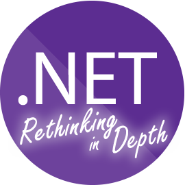

### .NET Rethinking in Depth
# WCF

A solution é composta por 4 projetos:

### MyServiceApp.ServiceContracts
Destinado aos contratos (Interfaces e TO's dos serviços)

### MyServiceApp.ServicesImplementations
Destinado à implementação dos serviços

### WcfHostConsole
Destinado ao Host WCF

### WcfClientConsole
Um exemplo de Consumo dos Serviços

## Pontos de Atenção

1. Projetos foram criados sob Full Framework (.NET 4.6.2) para exemplificar a hospedagem e consumo de serviços WCF. Esses conceitos de indireção podem ser usados com .NET Core, nas tecnologias suportadas pelo runtime escolhido.

1. O desenho se propõem a não exemplificar a não utilização de Service References em cenários controlados em uma mesma empresa/equipe/projeto.

1. MyServiceApp.ServiceContracts e MyServiceApp.ServicesImplementations compartilham o mesmo namespace mesmo estando em assemblies diferentes.

1. No WcfHostConsole a lista `Type[] services = new Type[] { typeof(TimeCalculatorService) };` é usada para demonstrar a capacidade de gerenciar múltiplos serviços, embora só expusemos 1.

1. MyServiceApp.ServiceContracts é um pacote de contratos, compartilhado aqui como referência direta do projeto, mas poderia facilmente ser gerado um pacote nuget contendo esse assembly e assim ser compartilhado no [NuGet.org](https://www.nuget.org/), [MyGet](https://www.myget.org/), File Server ou ainda em uma instância privada do [Inedo Proget](https://inedo.com/proget) ou [Nuget Server](https://github.com/NuGet/NuGet.Server).

1. Quebras nos contratos (remoção de parâmetros, mudanças nas TO's) possibilitam quebra de build. 

1. Cenários que usam injeção de dependência e inversão de controle são beneficiados com a possibilidade de trocar a utilização do serviço embarcado no AppDomain para um serviço remoto sem necessidade de refactoring.

1. O fato dos consumidores dos serviços não saberem distinguir entre o que é WCF e o que não é, aumenta a flexibilidade sob as decisões de tornar ou não um serviço qualquer embarcado ou WCF. Ficaria a critério da configuração da aplicação, container IoC/DI.

1. A hospedagem utilizando um Console Application é interessante, no entanto a utilização de serviços windows é melhor. Vale a pena olhar para o projeto [TopShelf](http://topshelf-project.com/) para saber mais sobre como trabalhar com serviços windows de uma forma mais organizada.
